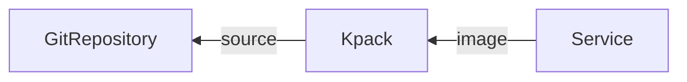

# Out of the Box Supply Chains for TCE

This Cartographer Supply Chain ties together a series of Kubernetes resources
which drive a developer-provided Workload from source code to a running Knative
Service in the Kubernetes cluster, updating it whenever changes occur to either
source code or base image used for building the application.



[Cartographer]: https://cartographer.sh
[Knative]: https://knative.dev/docs/
[Tanzu CLI]: https://github.com/vmware-tanzu/tanzu-framework
[`carto.run/ClusterSupplyChain`]: https://cartographer.sh/docs/v0.2.0/reference/workload/#clustersupplychain
[`carto.run/Workload`]: https://cartographer.sh/docs/v0.2.0/reference/workload/#workload
[`knative.dev/Service`]: https://github.com/knative/specs/blob/main/specs/serving/knative-api-specification-1.0.md#service
[kapp-controller]: https://github.com/vmware-tanzu/carvel-kapp-controller
[kpack]: https://github.com/pivotal/kpack
[source-controller]: https://github.com/fluxcd/source-controller

<!-- START doctoc generated TOC please keep comment here to allow auto update -->
<!-- DON'T EDIT THIS SECTION, INSTEAD RE-RUN doctoc TO UPDATE -->

- [Pre-requisites](#pre-requisites)
- [Install](#install)
- [Usage](#usage)
  - [Workload namespace setup](#workload-namespace-setup)
    - [Container Image Registry Secret](#container-image-registry-secret)
    - [ServiceAccount](#serviceaccount)
    - [RoleBinding](#rolebinding)
  - [Workload creation](#workload-creation)
    - [Optional Parameters](#optional-parameters)
- [License](#license)

<!-- END doctoc generated TOC please keep comment here to allow auto update -->


## Pre-requisites

- [Cartographer]
- [Knative]
- [Tanzu CLI]
- [kapp-controller]
- [kpack]
- [source-controller]


## Installation

0. Submit the Package and PackageMetadata objects to the cluster

```bash
kubectl apply \
  -f https://github.com/cirocosta/ootb-tce/releases/download/v0.0.0/package.yaml
  -f https://github.com/cirocosta/ootb-tce/releases/download/v0.0.0/package-metadata.yaml
```
```console
packagemetadata.data.packaging.carvel.dev/ootb-supply-chains.community.tanzu.vmware.com created
package.data.packaging.carvel.dev/ootb-supply-chains.community.tanzu.vmware.com.0.0.0 created
```

1. Familiarize yourself with the properties that can be configured

```bash
tanzu package available get ootb-supply-chains.community.tanzu.vmware.com/0.0.0 --values-schema
```
```console
KEY                  DEFAULT    DESCRIPTION

registry.server      <nil>      Address of the registry server where application
																images should be pushed to (required).
                                Examples:
                                  - index.docker.io (for DockerHub)
                                  - gcr.io (for Google Container Registry)
                                  - my-domain.com (for a custom registry deployment, like Harbor)

registry.repository  <nil>      Name of the repository in the image registry
																server where the application images from the
																workloads should be pushed to (required).

                                Harbor has the form repository: "my-project/supply-chain"
                                Dockerhub has the form repository: "my-dockerhub-user"
                                Google Cloud Registry has the form repository: "my-project/supply-chain"

                                Images are written to `$SERVER/$REPOSITORY/$WORKLOAD`.


cluster_builder      default    Name of the Kpack ClusterBuilder to
																use by default on image objects managed
																by the supply chain.


service_account      default    Name of the default service account in the namespace
																where the Workload is submitted to utilize for
																providing registry credentials to Kpack Image
																objects as well as deploying the application.
```


2. Create a file name `ootb-values.yaml` that specifies the default values to
   be used for the package.

For instance, assuming a DockerHub username "test", we could configure an
`ootb-values.yaml` file such as

```yaml
registry:
  server: index.docker.io
  repository: test
service_account: default
cluster_builder: default
```

in order to have the supply chain producing container images that land on
`index.docker.io/test/$workload_name`.


3. Install the package


```bash
tanzu package install \
  --package-name ootb-supply-chains.community.tanzu.vmware.com \
  --values-file ootb-values.yaml \
  --version 0.0.0 \
  ootb
```
```console
/ Installing package 'ootb-supply-chains.community.tanzu.vmware.com'
\ Getting package metadata for 'ootb-supply-chains.community.tanzu.vmware.com'
| Creating service account 'ootb-default-sa'
| Creating cluster admin role 'ootb-default-cluster-role'
| Creating cluster role binding 'ootb-default-cluster-rolebinding'
| Creating secret 'ootb-default-values'
| Creating package resource
/ Waiting for 'PackageInstall' reconciliation for 'ootb'
\ 'PackageInstall' resource install status: Reconciling


 Added installed package 'ootb'
```

Once installed, the following objects will have been submitted to the cluster:

```bash
kapp inspect -a ootb-ctrl
```
```console
Resources in app 'ootb-ctrl'

Namespace  Name                              Kind
(cluster)  app-deploy                        ClusterTemplate
^          image                             ClusterImageTemplate
^          ootb-supply-chain-basic-workload  ClusterRole
^          source                            ClusterSourceTemplate
^          supply-chain                      ClusterSupplyChain
```


## Usage

### Workload namespace setup

To make use of the supplychain, we must first have, in the same namespace as
where the Workload is submitted to, a couple objects submitted to so that the
resources managed by the supplychain  can properly do their work.

For this supply chain, aside from the Workload that we'll submit at the end, we
need:

- **container image registry secret**
- **serviceaccount**
- **rolebinding**

So first we'll go through the namespace setup, and then submission of the
Workload.


#### Container Image Registry Secret

Create a Secret that contains the credentials for Kpack to push container images to an image registry and Knative to make use it.

```yaml
apiVersion: v1
kind: Secret
metadata:
  name: registry-credentials
  annotations:
    secretgen.carvel.dev/image-pull-secret: ""
type: kubernetes.io/dockerconfigjson
data:
  .dockerconfigjson: e30K
```


#### ServiceAccount

Create a ServiceAccount to be used by Cartographer to manage the supply chain
resources as well as pass it down to them (the resources) so they are able to
gather necessary data and/or credentials to deal with the Kubernetes API.

Here we also associate the previously created Secret (`registry-credentials`)
to it so that anyone referencing such ServiceAccount also gather the
credentials to pull/push images to/from the container image registry where the
application should reside.


```yaml
apiVersion: v1
kind: ServiceAccount
metadata:
  name: hello-world
secrets:
  - name: registry-credentials
```


#### RoleBinding

Bind to the ServiceAccount the role that would then permit the controllers
involved to act upon the objects managed by the supplychain

```yaml
apiVersion: rbac.authorization.k8s.io/v1
kind: RoleBinding
metadata:
  name: hello-world
roleRef:
  apiGroup: rbac.authorization.k8s.io
  kind: ClusterRole
  name: ootb-supply-chain-basic-workload
subjects:
  - kind: ServiceAccount
    name: hello-world
```

### Workload creation

```yaml
apiVersion: carto.run/v1alpha1
kind: Workload
metadata:
  name: hello-world
  labels:
    app.kubernetes.io/part-of: hello-world

    # type of this workload. this is required in order to match this workload
    # against the supplychain bundled in this package.
    #
    apps.tanzu.vmware.com/workload-type: web
spec:
  # name of the serviceaccount to grant to Cartographer the necessary
  # privileges for creating/watching/etc the resources defined by the
  # supply chain.
  #
  serviceAccountName: hello-world

  params:
    # name of the serviceaccount to pass down to the objects created by the
    # supply chain. for brevity here we're using the, but it could very well
    # a different one.
    #
    - name: service_account
      value: hello-world

  # details about where source code can be found in order to keep track of
  # changes to it so the resources managed by the supply chain can create new
  # builds and deployments whenever new revisions are found.
  #
  source:
    git:
      url: https://github.com/kontinue/hello-world
      ref: {branch: main}
```


#### Optional Parameters

- `service_account` (string): overrides the default name of the serviceaccount (set in
  `ootb-values.yaml`) to pass on to the children objects.

- `cluster_builder` (string): overrides the default name of the clusterbuilder (set in
  `ootb-values.yaml`) to be used by the `kpack/Image` created by the supply
  chain.

- `registry` (object): overrides the default configured registry server and repository
  to be used by `kpack/Image` to publish application images. fields: `{server:
  <server_address>, repository: <repository_name>}`.


## License

Copyright 2022 VMware Inc. All rights reserved
